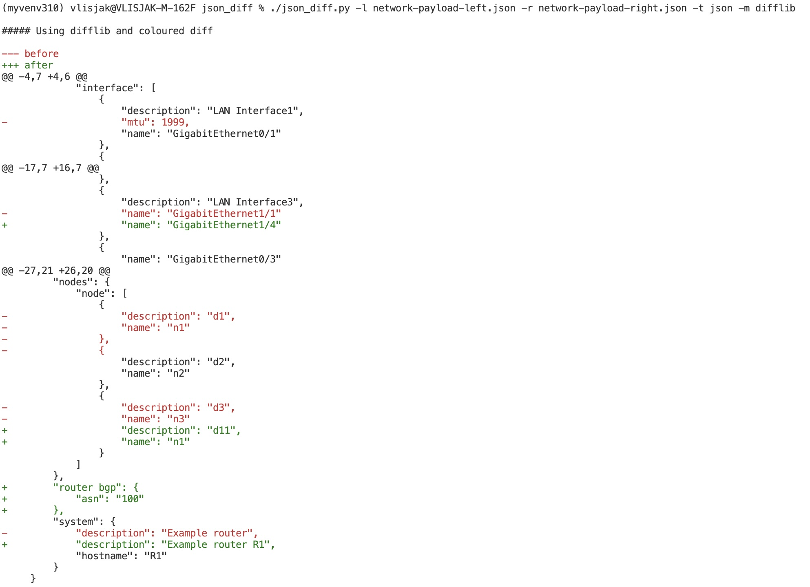

# JSON and XML diffs

## DeepDiff - probably most popular library:
`./json_diff.py -l network-payload-left.json -r network-payload-right.json -t json -m deepdiff`
```
##### Using DeepDiff

-------------------------DICTIONARY_ITEM_ADDED-------------------------

ADD | PATH  : yang-model-lisko:network/router bgp
ADD | LEFT  : not present
ADD | RIGHT : {'asn': '100'}


-------------------------DICTIONARY_ITEM_REMOVED-------------------------

DEL | PATH  : yang-model-lisko:network/interfaces/interface/0/mtu
DEL | LEFT  : 1999
DEL | RIGHT : not present


-------------------------ITERABLE_ITEM_REMOVED-------------------------

DEL | PATH  : yang-model-lisko:network/nodes/node/2
DEL | LEFT  : {'name': 'n3', 'description': 'd3'}
DEL | RIGHT : not present


-------------------------VALUES_CHANGED-------------------------

CHG | PATH  : yang-model-lisko:network/system/description
CHG | LEFT  : Example router
CHG | RIGHT : Example router R1


CHG | PATH  : yang-model-lisko:network/interfaces/interface/3/name
CHG | LEFT  : GigabitEthernet1/1
CHG | RIGHT : GigabitEthernet1/4


CHG | PATH  : yang-model-lisko:network/nodes/node/0/description
CHG | LEFT  : d1
CHG | RIGHT : d11
```

## Jycm - similar results to DeepDiff:
`./json_diff.py -l network-payload-left.json -r network-payload-right.json -t json -m jycm`

```
##### Using Jycm

-------------------------DICT:ADD-------------------------

ADD | PATH_LEFT  : 
ADD | LEFT  : __NON_EXIST__
ADD | PATH_RIGHT  : yang-model-lisko:network->router bgp
ADD | RIGHT : {'asn': '100'}


-------------------------DICT:REMOVE-------------------------

DEL | PATH_LEFT  : yang-model-lisko:network->interfaces->interface->[0]->mtu
DEL | LEFT  : 1999
DEL | PATH_RIGHT  : 
DEL | RIGHT : __NON_EXIST__


-------------------------LIST:REMOVE-------------------------

DEL | PATH_LEFT  : yang-model-lisko:network->nodes->node->[2]
DEL | LEFT  : {'name': 'n3', 'description': 'd3'}
DEL | PATH_RIGHT  : 
DEL | RIGHT : __NON_EXIST__


-------------------------VALUE_CHANGES-------------------------

CHG | PATH_LEFT  : yang-model-lisko:network->interfaces->interface->[3]->name
CHG | LEFT  : GigabitEthernet1/1
CHG | PATH_RIGHT  : yang-model-lisko:network->interfaces->interface->[3]->name
CHG | RIGHT : GigabitEthernet1/4


CHG | PATH_LEFT  : yang-model-lisko:network->nodes->node->[0]->description
CHG | LEFT  : d1
CHG | PATH_RIGHT  : yang-model-lisko:network->nodes->node->[1]->description
CHG | RIGHT : d11


CHG | PATH_LEFT  : yang-model-lisko:network->system->description
CHG | LEFT  : Example router
CHG | PATH_RIGHT  : yang-model-lisko:network->system->description
CHG | RIGHT : Example router R1
```
## DiffLib - result is similar to "legacy" diff, including red/green coloring in the terminal

`./json_diff.py -l network-payload-left.json -r network-payload-right.json -t json -m difflib`



## XML deepdiff:
`./json_diff.py -l left.xml -r right.xml -t xml -m deepdiff`

```
##### Using DeepDiff for XML


##### Using DeepDiff

-------------------------DICTIONARY_ITEM_ADDED-------------------------

ADD | PATH  : config/vrf/vrf-list/1/address-family/ipv4/unicast/export/route-target/address-list/name111
ADD | LEFT  : not present
ADD | RIGHT : 1:2


-------------------------DICTIONARY_ITEM_REMOVED-------------------------

DEL | PATH  : config/vrf/vrf-list/1/address-family/ipv4/unicast/export/route-target/address-list/name
DEL | LEFT  : 1:2
DEL | RIGHT : not present


-------------------------VALUES_CHANGED-------------------------

CHG | PATH  : config/vrf/vrf-list/1/rd
CHG | LEFT  : 1:2
CHG | RIGHT : 1:3


CHG | PATH  : config/vrf/vrf-list/1/address-family/ipv4/unicast/import/route-target/address-list/name
CHG | LEFT  : 1:2
CHG | RIGHT : 1:3


CHG | PATH  : config/router/bgp/bgp-no-instance/vrf/1/neighbor/id
CHG | LEFT  : 9.2.2.2
CHG | RIGHT : 9.2.2.3
```
