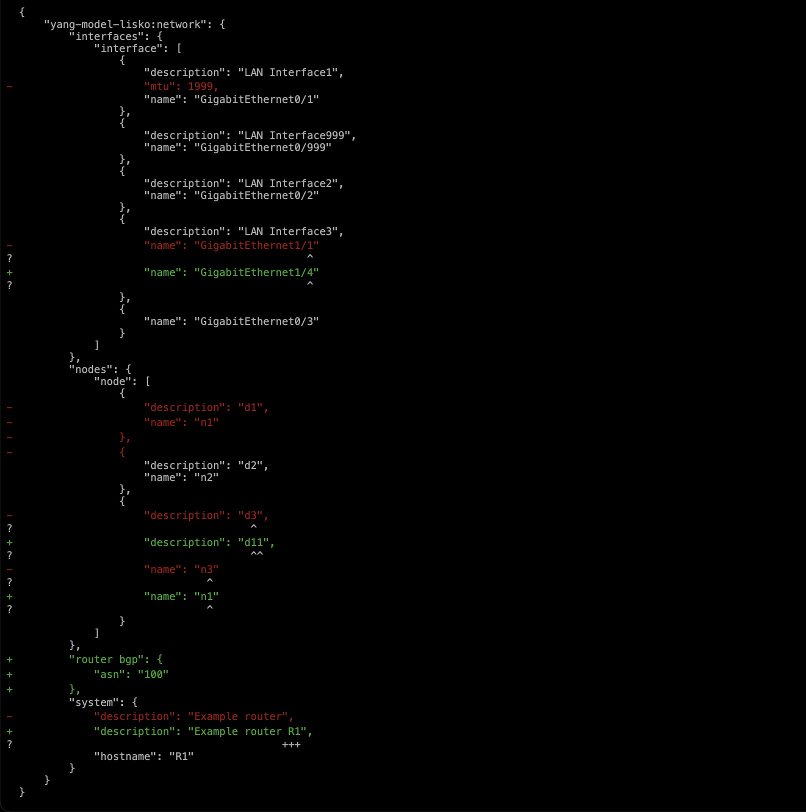
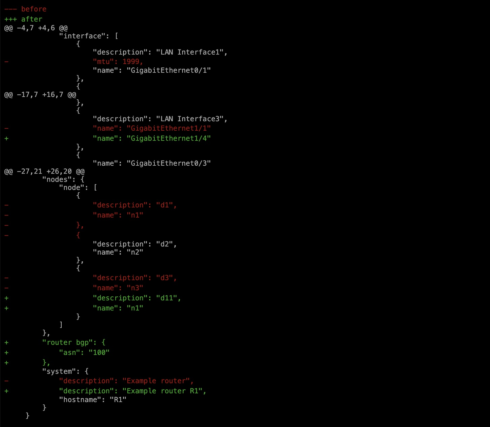
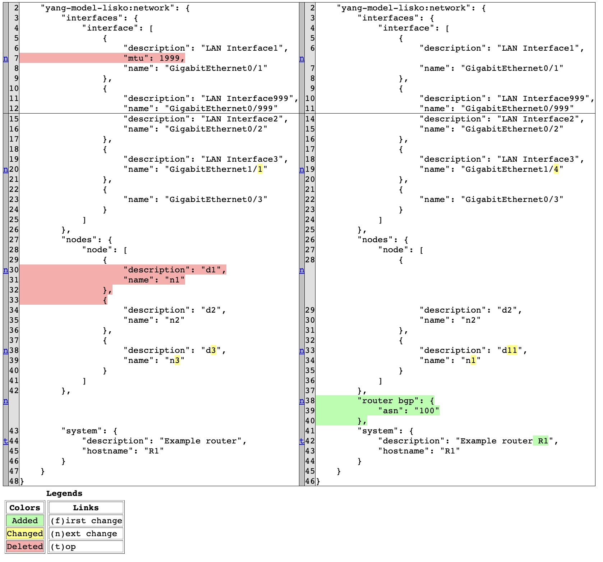

# JSON and XML diffs

## DeepDiff - probably most popular library:
`./json_diff.py -l network-payload-left.json -r network-payload-right.json -t json -m deepdiff`
```
+ PATH: yang-model-lisko:network/router bgp
+ LEFT:
not present
+ RIGHT:
{'asn': '100'}
--------
- PATH: yang-model-lisko:network/interfaces/interface/0/mtu
- LEFT:
1999
- RIGHT:
not present
--------
- PATH: yang-model-lisko:network/nodes/node/2
- LEFT:
{'name': 'n3', 'description': 'd3'}
- RIGHT:
not present
--------
? PATH: yang-model-lisko:network/system/description
? LEFT:
Example router
? RIGHT:
Example router R1
--------
? PATH: yang-model-lisko:network/interfaces/interface/3/name
? LEFT:
GigabitEthernet1/1
? RIGHT:
GigabitEthernet1/4
--------
? PATH: yang-model-lisko:network/nodes/node/0/description
? LEFT:
d1
? RIGHT:
d11
--------
```

## Jycm - similar results to DeepDiff (left and right path is shown)
`./json_diff.py -l network-payload-left.json -r network-payload-right.json -t json -m jycm`

```
+ PATH_L: 
+ PATH_R: yang-model-lisko:network->router bgp
+ LEFT:
__NON_EXIST__
+ RIGHT:
{'asn': '100'}
--------
- PATH_L: yang-model-lisko:network->interfaces->interface->[0]->mtu
- PATH_R: 
- LEFT:
1999
- RIGHT:
__NON_EXIST__
--------
- PATH_L: yang-model-lisko:network->nodes->node->[2]
- PATH_R: 
- LEFT:
{'name': 'n3', 'description': 'd3'}
- RIGHT:
__NON_EXIST__
--------
? PATH_L: yang-model-lisko:network->interfaces->interface->[3]->name
? PATH_R: yang-model-lisko:network->interfaces->interface->[3]->name
? LEFT:
GigabitEthernet1/1
? RIGHT:
GigabitEthernet1/4
--------
? PATH_L: yang-model-lisko:network->nodes->node->[0]->description
? PATH_R: yang-model-lisko:network->nodes->node->[1]->description
? LEFT:
d1
? RIGHT:
d11
--------
? PATH_L: yang-model-lisko:network->system->description
? PATH_R: yang-model-lisko:network->system->description
? LEFT:
Example router
? RIGHT:
Example router R1
--------
```
## DiffLib - result is similar to "legacy" diff + coloring the results

### Ndiff - shows full file with inline changes
`./json_diff.py -l network-payload-left.json -r network-payload-right.json -t json -m difflib -s ndiff > diff_result.html`



### Unified - shows inline changes with few lines before and after change
`./json_diff.py -l network-payload-left.json -r network-payload-right.json -t json -m difflib -s unified > diff_result.html`




### Html - nice html table with two columns (both files aligned and coloured)
`./json_diff.py -l network-payload-left.json -r network-payload-right.json -t json -m difflib -s html > diff_result.html`



## XML diff (-t xml)

All of above json methods are supported, such as:

`./json_diff.py -l left.xml -r right.xml -t xml -m jycm`

```
+ PATH_L: 
+ PATH_R: config->vrf->vrf-list->[1]->address-family->ipv4->unicast->export->route-target->address-list->name111
+ LEFT:
__NON_EXIST__
+ RIGHT:
1:2
--------
- PATH_L: config->vrf->vrf-list->[1]->address-family->ipv4->unicast->export->route-target->address-list->name
- PATH_R: 
- LEFT:
1:2
- RIGHT:
__NON_EXIST__
--------
? PATH_L: config->router->bgp->bgp-no-instance->vrf->[1]->neighbor->id
? PATH_R: config->router->bgp->bgp-no-instance->vrf->[1]->neighbor->id
? LEFT:
9.2.2.2
? RIGHT:
9.2.2.3
--------
? PATH_L: config->vrf->vrf-list->[1]->address-family->ipv4->unicast->import->route-target->address-list->name
? PATH_R: config->vrf->vrf-list->[1]->address-family->ipv4->unicast->import->route-target->address-list->name
? LEFT:
1:2
? RIGHT:
1:3
--------
? PATH_L: config->vrf->vrf-list->[1]->rd
? PATH_R: config->vrf->vrf-list->[1]->rd
? LEFT:
1:2
? RIGHT:
1:3
--------
```
